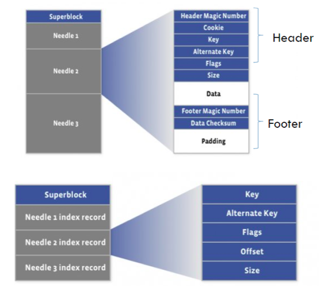

# Facebook Haystack Service 

---

Figure 1 depicts the steps from the moment when a user visits a page containing an image until she downloads that image from its location on disk.

When visiting a page the user's browser first sends an HTTP request to a web server .For each image [the web server constructs a URL directing the browser to a location from which to download the data.]{.mark}

For popular sites this URL often points to a CDN. If the CDN has the image cached then the CDN responds immediately with the data. Otherwise, the CDN examines the URL, which has enough information embedded to retrieve the photo from the site's storage systems. The CDN then updates its cached data and sends the image to the user's browser.

what is [CDN](onenote:Basic.one#CDN&section-id={86482390-C87C-1E49-9164-B76565805B41}&page-id={98B4402A-D864-7346-867E-B86E5AF1D934}&end&base-path=https://d.docs.live.net/77339d157d673f41/Documents/9%20chapter/System%20Design%20and%20OO%20Design)

the major lesson we learned is that CDNs by themselves do not a perfect solution to serving photos on a social networking site. CDNs do effectively serve the hottest photos but a social networking site like Facebook also generates a large number of requests for old photo which we refer to as the long tail. Request the long tail photo or old photo will cause cache miss in the CDN and we cannot cache whole photo

(10 TB around 87$)

Haystack achieves this goal by dramatically reducing the memory used for

filesystem metadata, thereby making it practical to keep all this metadata in main memory.

Haystack takes a straight-forward approach: it stores multiple photos in a single file and therefore maintains very large files.

The Directory maintains the logical to physical mapping along with other application metadata, such as the logical volume where each photo resides and the logical volumes with free space.

The Cache functions as our internal CDN, which shelters the Store from requests for the most popular photos and provides insulation if upstream CDN nodes fail and need torefetchcontent.

The Directory serves four main functions. First, it provides a mapping from logical volumes to physical volumes. Web servers use this mapping when uploading photos and also when constructing the image URLs for a page request. Second, the Directory load balances writes across logical volumes and reads across physical volumes. Third, the Directory determines whether a photo request should be handled by the CDN or by the Cache. This functionality lets us adjust our dependence on CDNs. Fourth, the Directory identifies those logical volumes that are read-only either because of operational reasons or because those volumes have reached their storage capacity.

When we increase the capacity of the Store by adding new machines, those machines are write-enabled; only write-enabled machines receive uploads. Over time the available capacity on these machines decreases. When a machine exhausts its capacity, we mark it as read-only.

There have logical volumes (storage) and physical volumes

we can assume each storage or logical volumes manages 100 G physical volume

A Store machine can access a photo quickly using only the id of the corresponding logical volume and the file offset at which the photo resides.

A Store machine keeps open file descriptors for each physical volume that it manages and also an in memory mapping of photo ids to the filesystem metadata and so we can retrieve the filename, offset, and size for a particular photo and physical volume id without needing disk operations

the physical file is like a large file cotnains the index and the data

.

The Index File

Store machines use an important optimization---the index file---when rebooting.

Index files allow a Store machine to build its in-memory mappings quickly, shortening restart time.

An index file's layout is similar to a volume file's, containing a superblock followed by a sequence of index records corresponding to each needle in the superblock.

These records must appear in the same order as the corresponding needles appear in the volume file.

The complications arise because index files are updated asynchronously, meaning that index files may represent stale checkpoints. When we delete a photo, the Store machine may do not updating the index file. needles can exist without corresponding index records and index records do not reflect deleted photos.

We refer to needles without corresponding index records as orphans.

During restarts, a Store machine sequentially examines each orphan, creates a matching index record, and appends that record to the index file. Note that we can quickly identify orphans because the last record in the index file corresponds to the last non-orphan needle in the volume file. To complete the restart, the Store machine now initializes its in-memory mappings using only the index files.

Since index records do not reflect deleted photos, Store machine may retrieve a photo that has in fact been deleted. To address this issue, after a Store machine reads the entire needle for a photo, that machine can then inspect the deleted flag. If a needle is marked as deleted the Store machine updates its in-memory mapping

**Photo Read**

When a Cache machine requests a photo it supplies the logical volume id, key, alternate key, and cookie to the Store machine. The cookie like a password and effectively eliminates attacks aimed at guessing valid URLs for photos.

When a Store machine receives a photo request from a Cache machine, the Store machine looks up the relevant metadata in its in-memory mappings. If the photo has not been deleted the Store machine seeks to the appropriate offset in the volume file, reads the entire needle from disk (whose size it can calculate ahead of time), and verifies the cookie and the integrity of the data. If these checks pass then the Store machine returns the photo to the Cache machine.

**Upload**

When uploading a photo into Haystack web servers provide the logical volume id, key, alternate key, cookie, and data to Store machines. Each machine synchronously appends needle images to its physical volume files and updates in-memory mappings as needed.

While simple, this append-only restriction complicates. Haystack disallows overwriting needles, photos can only be modified by adding an updated needle with the same key and alternate key.

1.ifthe new needle is written to a different logical volume than the original, the Directory updates its application metadata and future requests will never fetch the older version. 2.If the new needle is written to the same logical volume, then Store machines append the new needle to the same corresponding physical volumes. Haystack distinguishes such duplicate needles based on their offsets. That is, the latest version of a needle within a physical volume is the one at the highest offset.

**Delete**

Deleting a photo is straight-forward. A Store machine sets the delete flag in both the in-memory mapping and synchronously in the volume file. Requests to get deleted photos first check the in-memory flag and return errors if that flag is enabled.

File System : XFS

We use two straight-forward techniques to tolerate failures---one for detection and another for repair.

To proactively find Store machines that are having problems, we maintain a background task, dubbed pitchfork, that periodically checks the health of each Store machine. Pitchfork remotely tests the connection to each Store machine, checks the availability of each volume file, and attempts to read data from the Store machine.

If pitchfork determines that a Store machine consistently fails these health checks then pitchfork automatically marks all logical volumes that reside on that Store machine as read-only. We manually address the

underlying cause for the failed checks offline.

Once diagnosed, we may be able to fix the problem quickly.

Chinese version

<http://www.importnew.com/3292.html>

