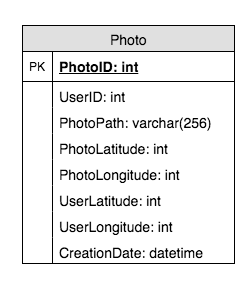

# Summary 2

Created: 2018-01-27 17:28:53 -0600

Modified: 2021-01-21 12:40:40 -0600

---

**Functional Requirements**

Users should be able to upload/download/view photos.

Users can perform searches **based on** photo/video titles.

Users can follow other users.

The system should be able to generate and display a user's timeline consisting of top photos from all the people the user follows.

**Storage**

we assume 1M daily active users. and every user upload 2 photo per day

2M new photos every day and 20 new photos every second. ( qps is 20)

Average photo file size => 200KB

Total space required for 1 day of photos : 2M * 200KB => 400 GB

Total space required for 5 years: 400GB * 365 (days a year) * 5 (years) ~= 712 TB

We need to store data about users, their uploaded photos, and people they follow

base on the requirement, so we have user table, photo table and friendship table

phone table store the user id and photo id and all metadata about the photo should go to this table.

we can store the photo in the sql database

{width="2.625in" height="3.1354166666666665in"}

the photo id will be the timestamp+ sequence number, so we can sort the id by time

One solution could be that we dedicate a separate database instance to generate auto-incrementing IDs

id

We aslo need the photo location table in the location service ( dictionary service) for the URL construction

the url is like

{width="5.0in" height="2.03125in"}

so we need the cdn, cache, machine id and logical vloumn

When a user visits a page the web server uses the Directory to construct a URL for each photo. The URL contains several pieces of information, each piece corresponding to the sequence of steps from when a user's browser contacts the CDN (or Cache) to ultimately retrieving a photo from a machine in the Store.

A typical URL that directs the browser to the CDN looks like the

following:

The first part of the URL specifies from which CDN to request the photo.

If the CDN cannot locate the photo then it delete the CDN address from the URL and contacts the Cache. The Cache does a similar lookup to find the photo and, on a miss, delete the Cache address from the URL and requests the photo from the specified Store machine.

for me photo meta datatable, if the read request is huge

we can use nosql and row key is photo id and column key is time stamp, userid and value will be the photot information

(For both of these tables, we can use a wide-column datastore like[Cassandra](https://en.wikipedia.org/wiki/Apache_Cassandra). For the 'UserPhoto' table, the 'key' would be 'UserID' and the 'value' would be the list of 'PhotoIDs' the user owns, stored in different columns. We will have a similar scheme for the 'UserFollow' table.)

We can store photos in a distributed file storage like[HDFS](https://en.wikipedia.org/wiki/Apache_Hadoop)or[S3](https://en.wikipedia.org/wiki/Amazon_S3).

There are serval parts:

1.  Web service
2.  Dictionary service : 1. Buildtheurlfor the photo
3.  logical machine : logical machine can have multiple physical machines
4.  physical machine will store the photos. There are two kind of physical machine : write enable and just read only. When machine is fully, we just change to ready only from write enable

Logical machine will store the information such asphoto id,id of the physical machine, the flags indicate the photos is deleted or not, file offset and file size.

Those information should store in the memory of the logical machine. We also have a write ahead log , the layout is same as the memory. We use this file torebuiltthe memory mapping quickly

When we update the photos or delete the photos, we may not update the index file on time. During the restart the machine , we need quick check the last record in the index file. compare it with the physical machine, to make sure the last record of the index file is the also the last record of the physical machine. There are no any new photos or delete during the machine restart.

Read

the user's browser first sends an HTTP request to a web server then web server. Web server will forward to location service and location will constructs a URL.

Theurlcontains several piece of information

We need first lookup to find the photos in CDN, if find the photo, return immediately. If not, update the URL andlook up the photos in the cache machine, if not, then go the memory of the physical machine to look for the id of the physical machine, offset ..

Update

When update the photos, first location service provided the logical machine and physical machine, then append the image to the physical machine and update the in memory mapping.

If the older image and new image are in the different machine, based on the information of direction machine, application will not go to the old machine.

If the they are in the same machine, which one has the higher offset will be the new one.

Delete

we just set a delete flag to the in memory mapping and index file

maintenance

we user job run periodically to check and maintenance the physical machine

if we want to high available of the system, we need to have multiple replicates of the physical machine, if one of service is dead, system is still available and service

4 .CDN

