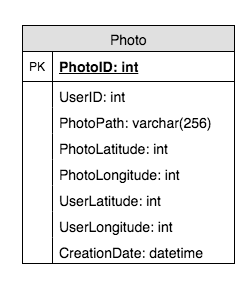

# Summary 3 

Created: 2021-01-21 12:28:34 -0600

Modified: 2021-04-26 14:48:00 -0600

---

Basically same as the twitter, just change the post to photo

**Functional Requirements**

Users should be able to upload/download/view photos.

Users can perform searches **based on** photo/video titles.

Users can follow other users.

The system should be able to generate and display a user's timeline consisting of top photos from all the people the user follows.

**Storage/Resource estimation**

we assume 1M daily active users. and every user upload 2 photo per day / read 10 photos per day

Read qps 120

Write qps 24

2M new photos every day and 20 new photos every second. ( qps is 20)

Average photo file size => 200KB

Total space required for 1 day of photos : 2M * 200KB => 400 GB

Total space required for 5 years: 400GB * 365 (days a year) * 5 (years) ~= 712 TB

We need to store data about users, their uploaded photos, and people they follow

base on the requirement, so we have user table, photo table and friendship table

phone table store the user id and photo id and all metadata about the photo should go to this table.

we can store the photo in the sql database

{width="2.625in" height="3.1319444444444446in"}

[Change the photo path to photo ID or the photo is just storage path, web service may need update the URL base on the CDN or cache]{.mark}

[Photo Table:]{.mark}

[User ID | photo ID | photo URL]{.mark}

the photo id will be the timestamp+ sequence number, so we can sort the id by time

One solution could be that we dedicate a separate database instance to generate auto-incrementing IDs

id

~~We aslo need the photo location table in the location service ( dictionary service) for the URL construction~~

the url is the location of object database

{width="5.0in" height="2.0277777777777777in"}

so we need the cdn, cache, machine id and logical volume

When a user visits a page the web server read the photo url from database and return to the web browsers, then

The browser will go to the CDN. The CDN, hopefully will have that photograph that you're looking for. If it doesn't, then it goes to the photo store service and the photo store service will go to the network attached storage and find the photograph that you're looking for and return it back to CDN and then it comes back to you.

The problem is if the photo is less popularity, you need going through the CDN into the NFS storage system to get it.

(So what that means is that with this NFS based design, there are two sources of bottlenecks. The first bottleneck is what is called metadata bottleneck.

In Unix, you'll have a file on the disk, and this file has a metadata, which we will call an inode. What typically happens is that in the DRAM of the server, you bring in this inode to the DRAM service and you're using this inode data structure to access the file. So this is the metadata. This is something that you pay for in any Unix system that you have inodes that have to be cached in the DRAM of the server for efficient access.

What I mean by metadata bottleneck in the context of the photo store is that we've got a staggering number of files here. If every photograph, even if you take 65 billion as the number right now, every photograph, if it is stored in a separate file, we're talking about 65 billion inodes. There is no way you have space in your DRAM for this many.

The way it works is that you are going to be caching the most recently accessed files and the metadata associated with that file. So the metadata bottleneck is one big problem when you have this NFS based design.

The second is the latency. So the latency because of the fact that if you miss in the CDN, then you're going all the way to the server to get it before you can see it on your browser is a big expense.

(facebook :uses the Directory to construct a URL for each photo. The URL contains several pieces of information, each piece corresponding to the sequence of steps from when a user's browser contacts the CDN (or Cache) to ultimately retrieving a photo from a machine in the Store)

A typical URL that directs the browser to the CDN looks like the

following:

The first part of the URL specifies from which CDN to request the photo.

If the CDN cannot locate the photo then it delete the CDN address from the URL and contacts the Cache. The Cache does a similar lookup to find the photo and, on a miss, delete the Cache address from the URL and requests the photo from the specified Store machine.

The real photo will stored in the bob storage like[HDFS](https://en.wikipedia.org/wiki/Apache_Hadoop)or[S3](https://en.wikipedia.org/wiki/Amazon_S3).

There are serval parts:

1.  Web service
2.  Dictionary service : 1. Buildtheurlfor the photo
3.  Logical machine + physical -->S3 object database or
4.  logical machine : logical machine can have multiple physical machines
5.  physical machine will store the photos. There are two kind of physical machine : write enable and just read only. When machine is fully, we just change to ready only from write enable

[Logical machine will store the information such asphoto id,id of the physical machine, the flags indicate the photos is deleted or not, file offset and file size.]{.mark}

Those information should store in the memory of the l[ogical machine]{.mark}. We also have a write ahead log , the layout is same as the memory. We use this file torebuiltthe memory mapping quickly

When we update the photos or delete the photos, we may not update the index file on time. During the restart the machine , we need quick check the last record in the index file. compare it with the physical machine, to make sure the last record of the index file is the also the last record of the physical machine. There are no any new photos or delete during the machine restart.

Read

the user's browser first sends an HTTP request to a web server then web server. Web server will forward to Dictionary service and Dictionary will constructs a URL.

Theurlcontains several piece of information

We need first lookup to find the photos in CDN, if find the photo, return immediately. If not, update the URL andlook up the photos in the cache machine, if not, then go the memory of the physical machine to look for the id of the physical machine, offset ..

Update

When update the photos, first location service find a available logical machine and physical machine, then append the image to the physical machine and update the in memory mapping.

If the older image and new image are in the different machine, based on the information of direction machine, application will not go to the old machine.

If the they are in the same machine, which one has the higher offset will be the new one.

Delete

we just set a delete flag to the in memory mapping and index file

maintenance

we user job run periodically to check and maintenance the physical machine

if we want to high available of the system, we need to have multiple replicates of the physical machine, if one of service is dead, system is still available and service

4 .CDN

