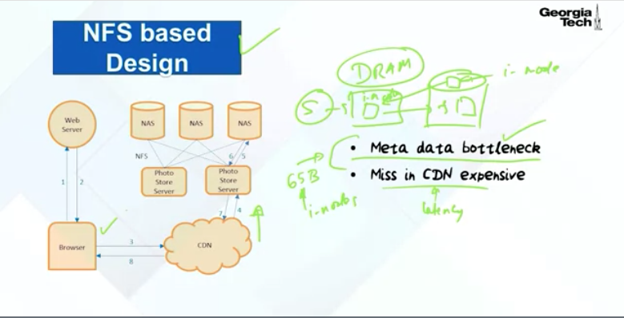

# Tradition Way 2

Created: 2018-02-04 11:23:34 -0600

Modified: 2021-02-02 17:17:01 -0600

---

Tradition

From an image's URL a Photo Store server extracts the volume and full path to the file, reads the data over NFS, and returns the result to the CDN.

generally incur 3 disk operations to fetch an image: 1. to read the directory (direction is mapping of file andinode) 2. second to load the inode into memory, and a third to read the file contents.

When reading a file for the first time a Photo Store server opens a file normally but also caches the filename to file handle mapping in memcache.

When requesting a file whose file handle is cached, a Photo Store server opens the file directly using a custom system call, open by filehandle. This way is only working for the popular photo it is not working for the old photos or long tail photos

Because the NASmetadata is too large to store all in the cache

However, that only addresses part of the problem as it relies on the NAS appliance having all of its inodesin main memory, an expensive requirement for traditional filesystems.

System needs enough main memory so that all of the filesystem metadata can be cached at once. In our NAS-based approach,one photo corresponds to one file and each file requires at least one inode, which is hundreds of bytes large. Having enough main memory in this approach is not cost-effective.)

<https://www.coursera.org/lecture/cloud-sys-software/facebook-haystack-nfs-based-design-Qcqpm>

The browser will go to the CDN. The CDN, hopefully will have that photograph that you're looking for. If it doesn't, then it goes to the photo store service and the photo store service will go to the network attached storage and find the photograph that you're looking for and return it back to CDN and then it comes back to you.

The problem is if the photo is less popularity, you need going through the CDN into the NFS storage system to get it.

(So what that means is that with this NFS based design, there are two sources of bottlenecks. The first bottleneck is what is called metadata bottleneck.

In Unix, you'll have a file on the disk, and this file has a metadata, which we will call an inode. What typically happens is that in the DRAM of the server, you bring in this inode to the DRAM service and you're using this inode data structure to access the file. So this is the metadata. This is something that you pay for in any Unix system that you have inodes that have to be cached in the DRAM of the server for efficient access.

What I mean by metadata bottleneck in the context of the photo store is that we've got a staggering number of files here. If every photograph, even if you take 65 billion as the number right now, every photograph, if it is stored in a separate file, we're talking about 65 billion inodes. There is no way you have space in your DRAM for this many.

The way it works is that you are going to be caching the most recently accessed files and the metadata associated with that file. So the metadata bottleneck is one big problem when you have this NFS based design.

The second is the latency. So the latency because of the fact that if you miss in the CDN, then you're going all the way to the server to get it before you can see it on your browser is a big expense.

{width="10.083333333333334in" height="5.1875in"}

