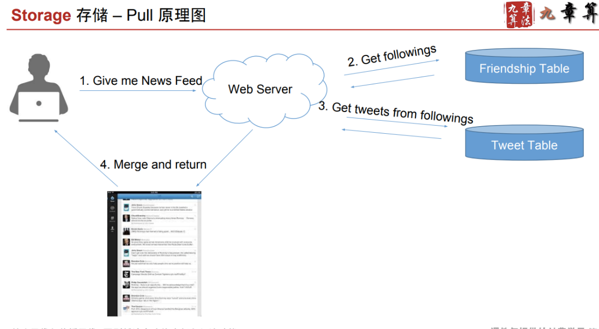

# Pull Model

Created: 2017-09-16 10:28:25 -0600

Modified: 2017-09-16 17:33:49 -0600

---

pull mode:

when user load ,

grape the post, tweet from each people and merge together

{width="5.0in" height="1.53125in"}

{width="5.0in" height="2.75in"}

{width="5.0in" height="2.9791666666666665in"}

{width="5.0in" height="2.6666666666666665in"}

![东 邪 黄 药 用 2016 ． 11 ． 29 QI .memcachee 有 单 独 的 clusterll$ 还 是 和 每 个 db 在 一 起 呢 ？ 似 手 两 个 可 以 结 合 起 来 一 个 《 oca 《 一 个 remote? Al ： memcached 是单 独 的 cluster ， 并 不 和 db 捆 绑 在 一 起 。 有 一 个 东 西 叫 做 mcrouter, 可 以 负 责 memcached 的 load balance 和 sharding- 一 般 来 说 ， 普 通 的 系 统 的 话 ， 直 接 remote 就 好 了 ， 因 为 memcached 和 db---W 在 同一 个 data center, 他 们 之 间 的 通 信 Latency 是 很 小 的 可 以 忽 略 。 上 述 设 计 基 本 都 是 鸲 用 的 。 如 果 对 于 latency 要 求 很 高 很 高 的 话 ， 那 么 才 需 要 在 每 个 web server 上 去 开 一 个 《 oca | 的 memcached ， 注 意 ， 是 在 web server 上 ， 而 不 是 database 上 。 因 为 请 求 最 先 到 达 的 是 web server ， 你 放 在 database 上 不 能 解 决 延 迟 的 问 题 。 Q2 对 timeline 的 cache key 应 该 是 user id, va 《 ue 就 是 1000 条 ？ 每 次 user 先 invalidate cache, update db, 冉 update cache? A2: keyßuser id 加 一 个 pre 徽 表 示 这 是 存 的 如 me 《 ine （ 比 如 "timeline::123") ， valuee list of tweet ids, 不 存 具 体 的 每 一 条 tweet 的 具 体 内 容 ， 只 存 id- 然 后 还 会 有 一 个 key 为 "tweet::345", va 《 ue 为 具 体 的 一 条 tweet 内 容 的 存 在 cac № 里 。 user p t 的 时 候 ： invalidate cache ． > update db 。 这 个 时 候 并 不 update cache- 只 有 当 有 人 需 要 他 的 timeline" 候 ， 去 读 的 时 候 ， 才 readfromdb->updatecacheo Q3. slides 里 讲 " 有 Cache News Feed 的 崩 户 。 归 并 N 个 户 的 在 某 个 时 间 戳 之 后 的 所 有 Tweet 酽 这 个 timestamp 应 该 存 在 哪 ？ cache 的 key 应 该 ihEuser id? 每 次 read cache+ 归 并 完 成 后 gupdate--- 下 这 个 cache 对 吗？ A3: i*Ttimestamp 可 以 存 Eclient, 也 就 是 手 机 上 ， 这 个 请 求 是 客 户 端 发 起 的 ， 客 户 端 会 知 道 自 已 现 在 的 数 据 最 新 的 一 条 是 什 么 时 候 的 。 这 个 时 候 的 key 可 以 是 № ewsf d ： ： 123 六 所 以 这 是 为 什 么 要 加 prefix ， 台 则 你 怎 么 区 别 是 timeline 里 的 东 西 还 是 newsfeedfi 东 西呢。 " 每 次 read e + 归 并 完 之 后 u a 怡 这 个 e 吗 ？ " ． > 对 的 。 Q4. 我 自 己 没 有 使 太 多 NoSQL DB 的 经验（ 就 用 过 dynamoDB), 所 以 designfi 候 不 太 RENOSQL. 应 该 如 何 解 决 比 较 好 呢 ？ 还 是 说 可 以 不 说 明 具 体 NOSQL DB ， 就 设 计 一 个 大 部 分 都 支 持 的 ne c scheme A4: 用 过 dynamoDB 已 经 很 不 错 了 。 一 般 来 说 都 会 问 你 具 体 用 什 么 db- 而 选 择 SQL 和 NoSQL 最 最 堂 用 的 依 据 是 看 你 怎 么 query. 如 果 你 que 的 方 式 非 堂 間 单 ， 类 似 于 key-value 那 样 query, n q 《 是 最 好 的 。 如 果 que 的 方 式 非 堂 复 杂 ， 经 堂 对 于 同 一 类 数 据 需 要 filter by 个 columns, 那 么 就 SQL. Q5. 当 时 interviewerfiÄ*N 想 让 我 对 每 个 user 存 一 个 last_update_time 在 memcache 里 ， 之 后 归 并 时 对 每 个 用 户 比 较 下 last_update_time 和 last client refresh t血蚓这 个 可 以 存 client), 在 last client refresh time 之 后 没 有 update 的 用 户 可 以 直 接 skip ](../../media/Twitter-^M-Insgram-Twitter---News-Feed-Pull-Model-image5.png){width="5.0in" height="4.729166666666667in"}

{width="5.0in" height="0.34375in"}

![东 邪 黄 药 用 2016 ． 09 ． 23 ql ． ppt 中 说 道 ， " 有 Cahce News Fe 丽 的 虍 户 ： 归 并 N 个 用 户 在 某 个 时 间 戳 之 后 的 所 有 Tweets. 为 什 么 要 以 这 个 时 间 戳 为 界 限 ？ 不 是 说 按 照 所 有 f 酬 。 wees 的 最 近 100 条 tweets ， 进 行 排 序 ， 然 后 只 取 最 up ． t 。 ． date 的 100 条 。 如 果 取 的 时 间 戳 过 早 ， 那 么 效 率 不 高 ； 如 果 取 的 时 间 戳 过 晚 ， 那 么 可 能 漏 取 。 这 里 我 想 ， ppt 应 该 是 考 虑 的 怕 取 的 时 间 戳 过 早 ， 而 多 取 了 无 效 数 据 。 以 上 仅 仅 是 个 人 的 猜 测 ， 还 请 老 师 解 答 。 al ： 这 里 说 的 不 是 第 一 次 请 求 ， 而 是 比 如 我 10 秒 前 请 求 过 一 次 我 的 news feed 了 ， 那 么 现 在 你 冉 需 要 的 时 候 ， 你 接 看 你 上 次 请 求 的 最 后 一 个 帖 子 的 时 间 戳 来 请 求 这 个 时 间 戳 之 后 的 新 发 布 的 帖 子 。 这 样 你 就 不 用 重 复 的 去 取 那 些 取 过 的 了 。 ](../../media/Twitter-^M-Insgram-Twitter---News-Feed-Pull-Model-image7.png){width="5.0in" height="1.6770833333333333in"}

