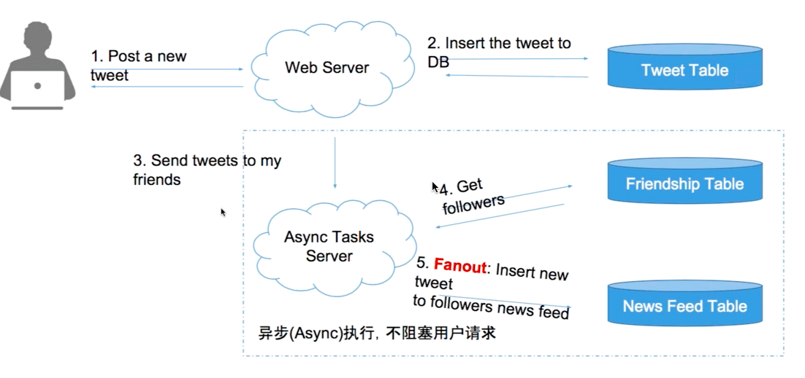
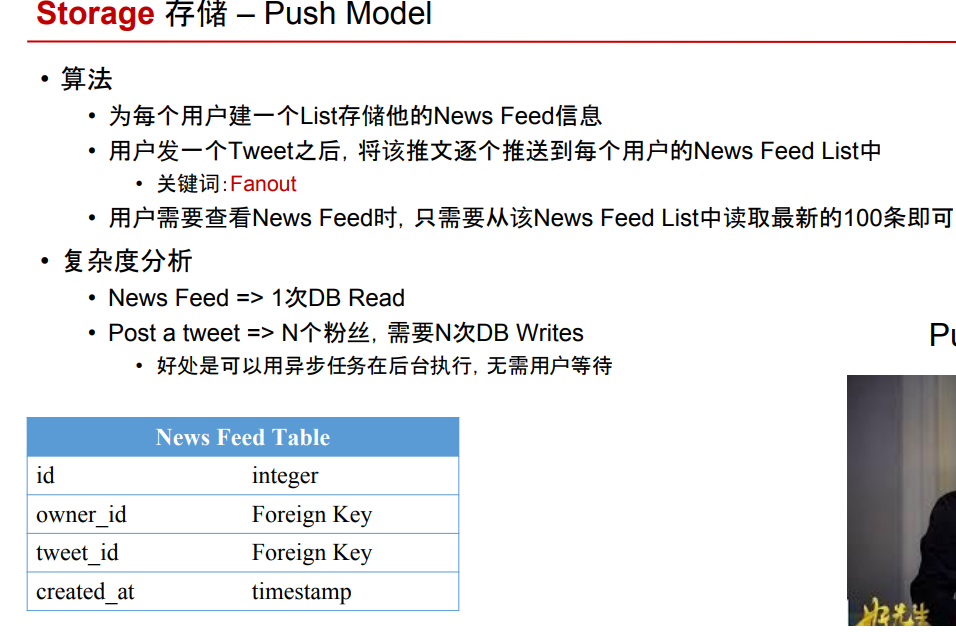

# Push Model

Created: 2017-09-16 10:30:14 -0600

Modified: 2017-09-21 00:19:08 -0600

---

push model

create new feed table , for example when I post new tweet, write this tweet to every people `s new feed table whole followed you

{width="5.0in" height="2.3541666666666665in"}{width="5.0in" height="3.3055555555555554in"}

![老 师 同 学 好 ， 关 于 news feed 还 是 有 些 不 明 白 的 地 方 ． 之 前 东 邪 老 师 说 news feed 是 共 用 同 一 个 newsfeed ble, 然 后 user 请 求 news feed 时， 冉 去 做 select•fromnewsfeedwhereowner_id=your_idlimitlOO; 之 类 的． 我 的 理 留 是 （ 不 确 定 是 否 正 确 ） ， news feed 的 上 游 会 有 一 个 news feed generator, 负 责 计 算 一 连 串 的 分 数 计 算 后 ， 产 生 这 个 user 可 以 看 到 的 news feed, 然 后 写 进 table. 举 个 例 子 ， 若 userA 和 user B 是 朋 友 ， 当 B 发 了 一 篇 文 ， news feed generator 会 去 决 定 这 篇 文 章 是 否 该 呈 现 给 A （ 这 边 logic 包 括 relevanæ, blacklist, grouplist 那 些 ） ， 如 果 最 后 算 出 来 决 定 A 可 以 看 到 ， 那 generator 会 把 这 条 entry (news_feed id, poster_id, owner id, content, timestamp) 写 入 newsfeed table 我 的 疑 问 是 ， news feed table 一 定 会 长 很 快 ， 所 以 一 定 得 对 他 做 sharding. 但 想 了 想 ， 好 像 没 有 比 较 台 适 的 sharding 方 式 ． 如 果 对 news_feed_id 做 sharding, 那 一 个 select request 要 跑 所 有 的 机 器 ， 因 为 每 台 机 器 上 都 有 可 能 有 owner_id = A 的 entry. 这 种 方 式 似 乎 不 scalable. 如 果 对 owner_id 做 sharding, 假 设 A 有 很 朋 友 ， news feed generator 为 A 与 入 的 entry 很 多 ， 这 样 又 好 像 会 有 机 器 资 料 分 布 不 均 的 问 题 ． 还 是 说 news feed 本 身 不 适 合 SQL 解 呢 ？ NoSQL 有 更 好 的 approach 吗 ？ 思 路 有 点 氵 昆 乱 " 1 个 回 复 九 章 管 理 员 答 案 是 按 照 owner_id msharding- 至 于 你 的 问 题 ： 2016 ． 09 ． 04 假 设 A 有 很 多 朋 友 ， news feed generator 为 A 写 入 的 entry 很 多 ， 这 样 又 好 像 会 有 机 器 资 料 分 布 不 均 的 问 题 ． 不 会 不 均 匀 ， 因 为 一 个 人 " 关 注 ． 的 对 象 ， 不 会 太 ， 1 佣 0 什 么 的 撑 死 ， 10 万 什 么 的 都 是 spam ， 会 被 踢 掉 的 。 Newfeed 比 较 适 合 NoSQL0 当 上 面 你 的 问 题 跟 《 还 是 nosq 《 没 有 太 大 关 系 。 nosq 《 的 情 况 下 ， row_key(hash_key, partition_key)=owner_user id,column_key=post_id,value=post 的 基 本 信 息 什 么 的 。 ](../../media/Twitter-^M-Insgram-Twitter---News-Feed-Push-Model-image3.png){width="5.0in" height="4.784722222222222in"}![Mini twitter design push mode 《 问 题 、 L by 王 同 学 3 C) 1 周 ， 4 日 前 、 L Ta: 徐 星 宇 请 问 老 师 ， 在 误 上 讲 的 newsfeed 的 push model- 我 有 个 问 题 。 ppt 上 anewsfeed table 样 的 北 ， ownerid ， twitterid, createtime"o 確 实 可 以 通 过 一 个 db search 找 到 所 有 关 于 某 个 owne 的 前 N 个 Fwi № r id- 我 的 问 题 是 ， 拿 *IJFwitter id 以 后 ， 不 是 还 是 得 去 DB 找 相 关 № i № r 的 内 容 吗 ？ 这 不 又 是 N 次 DB queryJ$? PPT 上 的 表， twitter id 可 能 为 了 讲 课 方 便 ， 就 是 写 的 内 容 " 黄 蓉 怎 样 怎 样 " 。 当 时 没 反 应 过 来 ， 现 在 复 习 的 时 候 发 现 我 拿 到 的 这 是 冠 啊 ， 求 老 师 解 笞 ？ 总 结 一 下 问 题 就 是 ， newsfeed table 可 以通 过 一 次 DB 拿 到 前 N 个 twitterlD ， 但 是 前 N 个 献 丽 D ， 你 得 每 个 去 twi № r table 里 找 ， 这 个 是 没 办 法 避 免 的 对 吗 ？ 3 个 回 复 马 克 助 教 createtime = 0m tables Old 巳 二 By select ownerid, twitterid, 类 似 于 这 条 语 句 我 们 不 仅 可 以 获 取 到 同 样 我 们 也 可 以 把 其 他 的 内 容 同 时 ect 出 来 。 2017 ． 09 £ 5 1 土 m 工 10 ； ](../../media/Twitter-^M-Insgram-Twitter---News-Feed-Push-Model-image4.png){width="5.0in" height="3.0625in"}![王 同 学 2017 ． 09 £ 5 谢 谢 马 克 助 教 回 复 ， 不 过 我 问 的 并 不 是 这 个 意 思 ， 我 的 MH-enewsfeed table 里 面 并 没 有 存 № r 的 具 体 内 容 ， 只 有 twitter 的 id ， 当 然 也 有 你 上 面 提 到 的 那 些 信 息 ， 但 对 于 駡 户 来 讲 ， 他 不 是 要 看 到 news 的 具 体 内 容 吗 ， 就 算 一 次 db que 拿 到 你 上 面 说 的 所 有 信 息 ， 不 是 还 要 去 twi № r 怡 b 《 e 里 找 具 体 的 № № r 内 容 是 什 么 吗 ？ 因 为 个 newsfeed*iQ 计 就 是 这 样 的 ， ownerid, twitterlD ， createtime"- 例 如 我 拿 到 了 于 我 应 该 看 到 的 № 《 № rlD 以 后 ， 我 还 得 通 过 这 个 《 D 去 拿 具 体 内 容 ， 甚 至 这 个 tw 》 № r 还 有 照 片 什 么 的 ， 这 都 要 继 续 qu DB 不 是 吗 ？ 所 以 一 个 决 方 法 是 denormalize ， 把 twitterH 体 内 容 也 加 到 newsfeed table 里 。 这 样 也 是 说 每 个 twitter 内 容 存 两 份 ， 一 份 在 原 始 的 tw r 表 里 ， 一 份 在 newsfeed* 里 。 这 样 解 决 行 吗 ？ 我 总 是 感 觉 这 样 好 浪 费 资 源 。 实 际 大 公 司 又 是 怎 么 做 的 呢 ？ 求 指 教 2017 ． 09 £ 6 @王 同 学 1 ． 我 觉 得 使 Join 应 该 就 可 以 把 twi № r 里 面 的 con 怡 nt 也 在 一 个 SQL 语 句 里 取 出 来 了 。 2 ． de 閬 " a e 是 个 好 方 法 ， 我 们 甚 至 可 以 存 在 che 里 面 ， 加 速 内 容 的 读 取 。 实 际 中 大 家 一 般 在 DB 上 都 有 一 层 Cache ， 我 们 会 把 入 Cache, Cache 能 够 帮 DB 挡 住 很 大 一 部 分 读 操 作 。 ](../../media/Twitter-^M-Insgram-Twitter---News-Feed-Push-Model-image5.png){width="5.0in" height="3.3055555555555554in"}

