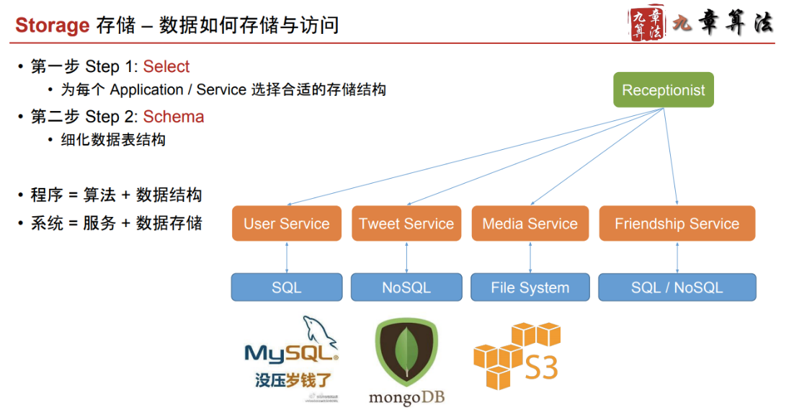

# Storage

Created: 2017-10-15 16:27:46 -0600

Modified: 2017-10-15 16:33:14 -0600

---

{width="5.0in" height="2.5833333333333335in"}

{width="5.0in" height="2.7708333333333335in"}

How to store the news Feed?

news feed: my post + follower post

time line: just follower post

news feed will store in no SQL database and

