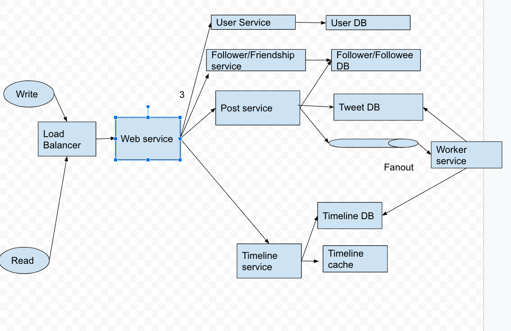

# Summary 3

Created: 2021-01-10 17:00:31 -0600

Modified: 2021-04-24 17:42:42 -0600

---

{width="10.083333333333334in" height="6.552083333333333in"}

**Function:**

1.  post tweet , the tweet should contains text, image and video
2.  create and display the newsfeed or timeline based on user and his follower`s post or tweet. Display those tweets base on...
3.  follower and unfollow other user
4.  System should push the new post for all active users

**Non function Requirement**

High availability

Low latency

**QPS**

We assume we have 600M DAU and each user everyday has 60 read requests such as read the post and 0.1 write request

read peek * 3

read QPS = 600 M * 60 /86400

write QPS = 600 M * 0.1 /86400

**Storage:**

We assume each post has maximum 130 characters and each character has 2bytes and we have around 30 byte for meta data of each tweet like post id, user id ..

for message : 600 M * 0.1 * (130*2+30) = 18 G / day

[Post table]{.mark}

[Post id | user id | meta data ...URL | time stamp -- shard by post id]{.mark}

[NewsFeed table (time line)]{.mark}

User id | post id | create time

[Shared by user id , sort by post id, primary key is { User id + post id }]{.mark}

**High level design**

<https://docs.google.com/drawings/d/1j9zAkOwyu8SV5iw93D1KsNfOhwjvFe_jDM-o-u9Kw_A/edit>

We should use hybrid mode

1.  For the normal user, we use the fanout model or push model, we post a tweet, system just call write API and write the tweet to the tweet table

2.  when user post a tweet, the system first persist the tweet in the database layer

3.  Then post service will base on the friendship database, and other setting like mute..

Send the friend id and post id to message queue

4.  Fan out worker will fetch the data from queue and update the new feed table

write the tweet id insert to timeline cash (radis) and newsfeed table ( owner id, tweet id and time stamp). Primary key is {owner id + tweet id }

5.  when user want to read the timeline, they just call the timeline service , query the timeline cash/table , find out all tweet id then grab the tweet from the tweet table

they will check the cache if exists the time line , then read the timeline table to get the all the posts from this follower

6. for the celebrity people, we need read his post from post database directly. Those post should be cache {user id ->{post id } }

