# Summary -- ACE

---

The web crawler has 5 part: seed URL, URL frontier, fetcher and render, webpage storage and html processor

1.  [Seed URL]{.mark} is input of the system, the system start with seed URL,

It is the initial URL, we can collect like top 100 sites and then make a list of it and then have it as a seed URL and then push it into URL frontier

2.  [URL frontier]{.mark} is the data structure which actually is built using queues which actually to handle the priority and politeness features, and give the URL to feather to craw

Priority means when to re-crawl , some website always has new context, so they should have high priority

Politeness means we should have some delay between each crawl for same website and always ensure that only one connection is always established from the crawler to the server

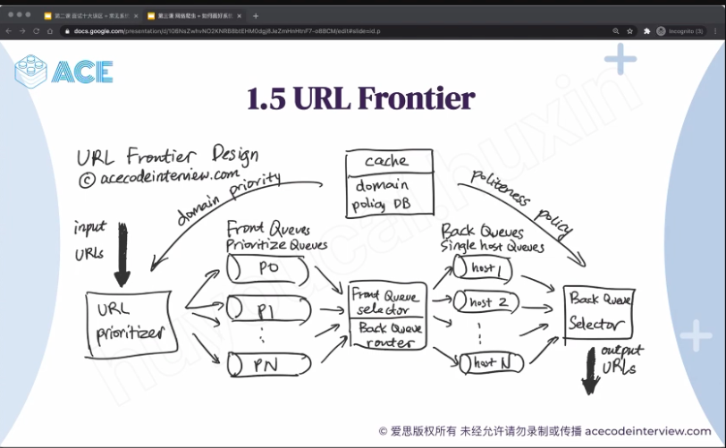

First, we have a URL prioritizer service, it pick up the URL from the url seeds and put to different Queue base on the prioritize, if all URLs have priority from 1-10 so we can have 10 [front queues , high priority URL will go to the higher number]{.mark}

Then front queue selector will 1. pick up the URLs from the front queue base on the priority ( always pick up the URL from high priority queue) and push to the back queue. 2. It will keep monitor the back queue and ensure none of the back queue is empty

[The number of the back queue equals to the number of the fetcher worker]{.mark}

One back queue will be destinated one and only one host, we have a table map the host to the back queue number

It is for politeness, we don't want to make thousands of call go a same website at the same time. We want make a call one by one with some delay

I fetch one page from page now at time t1 that that means that the next call should happen after t1 with some delay and push it back to the heap, There is a heap will sort the url base on the next time it will be craw

(that's why we need to put it in the queue so we get the ordering of the same of the URLs, of the same hostname, so we can easily implement the politeness)

[Then back queue seletor]{.mark} will go to the heap the pull a url on the top of the heap and give it to fetcher

3.  For the Fetcher and render, we can consider there are cluster of worker is running multiple server. Those crawling thread connect the internet and download the document base on the given URL and the appropriate protocol

[For service side render,]{.mark} a lot of website currently use React or AnglersJS, it don't have really HTML page. We need download those javascript and run it locally ( net.js) ------ [? Render 是 下载下来？]{.mark}( people are doing the index page they do server-side rendering from their side itself)

If we want to scale up, we can deploy the fetcher and render to the different location since we can access the some small web site quickly if fetcher can close to the website service

(one more thing the fetcher should do is set the user agent to appropriate, you know crawling company name or something like Google sets it to Google - something as a user agent and similarly and X and other Bing doctor go sets it to its own, user agent the advantage is so that the website admins can configure these servers to behave a little bit differently for the search engine itself)

If we have different protocol, we need remember which crawler user which type protocol

[DNS resolver,]{.mark} if we can customize our own DNS resolver, we can get the IP address more quickly compared with the public DNS resolver

(public, 200/Minutes, customize 20,000./minutes)

( if we use signal thread, it will case a problem like

[all the threads are blocked because of that thread if waiting for the IP address.]{.mark}...)

After we download the page first we need to save the html page to bigtable and update the domine DB and web crawl history DB

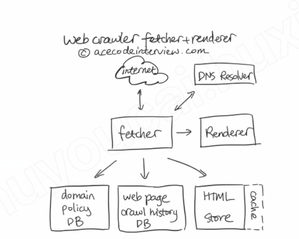

4.  After we download the page first we need to send the web page to [HTML processor]{.mark}, the HTML processor has 2 part:

A.  Get the content signature

B.  we will extract the links from HTML pages

(We can use MD5 or SHA or minHash to calculate these checksums)

there is algorithm call document fingerprint and store a 64 bit check sum we put some small to the memory and larger sored list in the disk.

The content-seen test first checks if the fingerprint is contained in the in-memory table. If not, it has to check if the fingerprint resides in the disk file.

The fingerprint is sort in the desk, we can maintenance an index in the memory and identify which fingerprint in which disk block, in the disk block, we also has an index file for the fingerprint and his offset

When a new fingerprint is added to the document fingerprint set, we can index it (it is added to the in-memory table --- [怎么 index]{.mark}). When this table fills up, its contents are merged with the fingerprints on disk, at which time the in-memory index of the disk file is updated as well.

if the document is new, we can pass it to [URL Processor]{.mark} modelwe will [normalized the URL]{.mark} we extract from the from HTML pages and save the pages to the file system.

5.We pass those URL link to the URL filter first.

We need test if theurlhas been seen before. To perform the URL-seen test, we store all of the URLs a large table called the[web page crawl history table]{.mark}.

If the content 90% same, we can say the webpage is in the same group

For example, if we found one webstie's content is always not changing. We can set it a low frequency in "intended crawl frequency "

Base on the ~~web page crawl history table~~ robot.txt we need to update the

[domine police DB to decided the url priority ---]{.mark}Backqueue router will read domine police DB

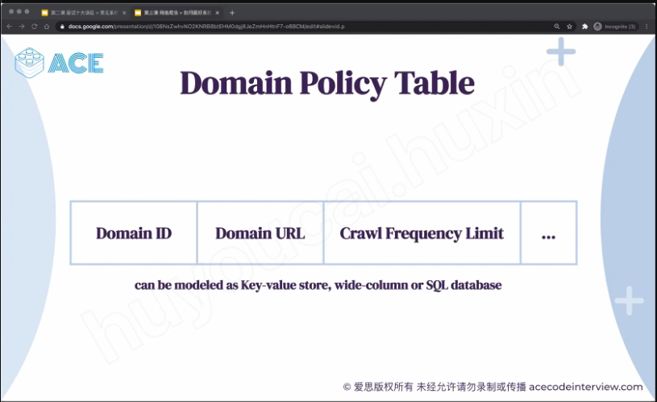

[Domine police DB]{.mark} also has a priority column, it base on the frequency of the content it is changing

6.after pass theurltest, we will feed the url to URL frontier

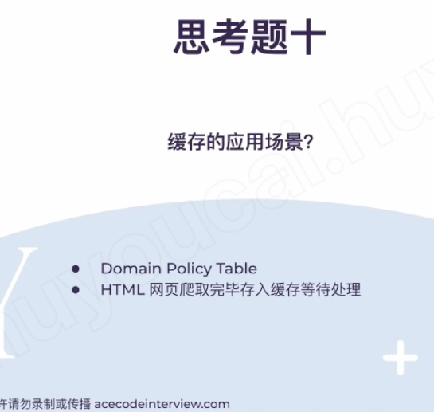

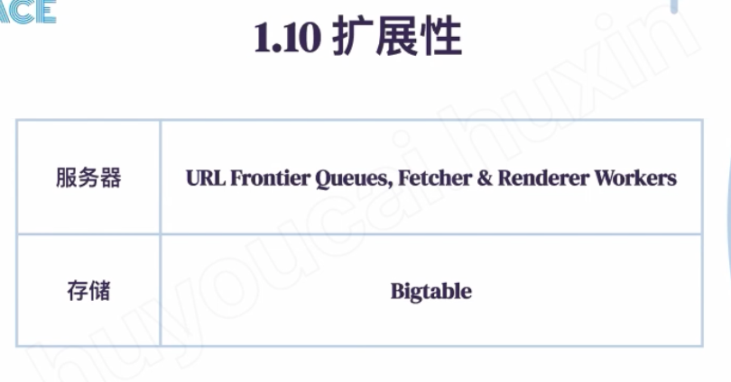

If system has problem , worker is staless

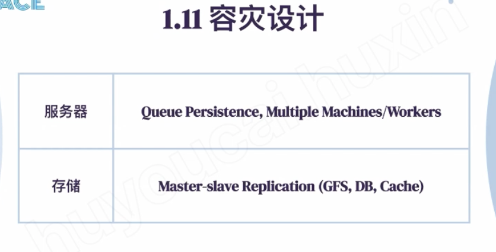

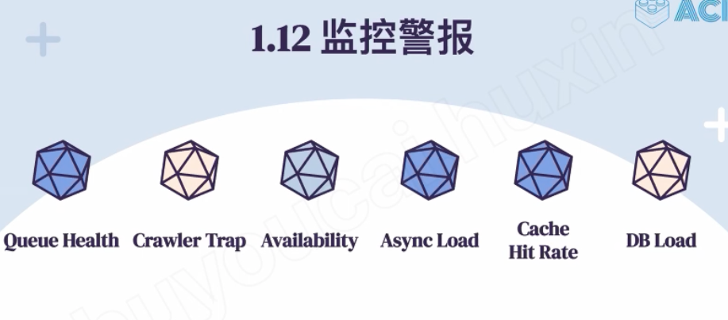

![0 b 0 ， " 0 伍 ` 0 屮 @"e。彘法""每 " 以 山 p ． HTML 》 · 以 L 出 ． 一 三 诀 [叵@] 0 《 Uaext' 、 凼一 （ " S 哼 血 | 0 爰 思 版 权 所 有 未 经 允 许 诺 勿 录 制 或 传 地 acecodeinterview ℃ om ](../../media/Web-crawler-^MP2p-Web-Crawler-Summary----ACE-image12.png)

How to store: big table

<https://www.cs.rutgers.edu/~pxk/417/notes/content/bigtable.html>

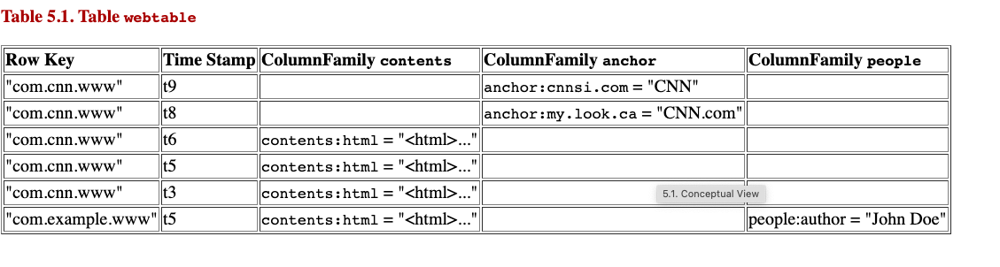

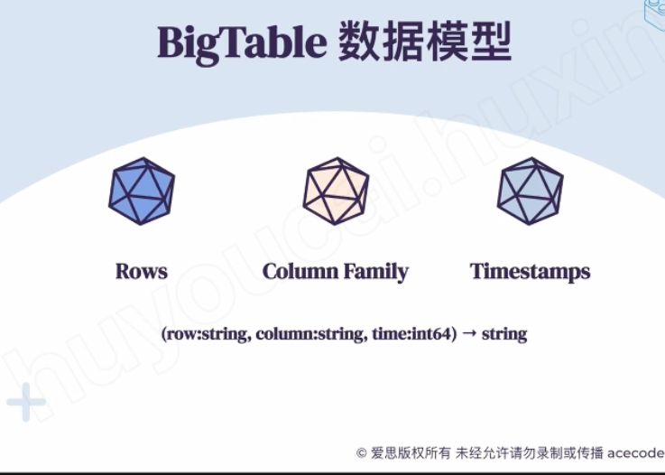

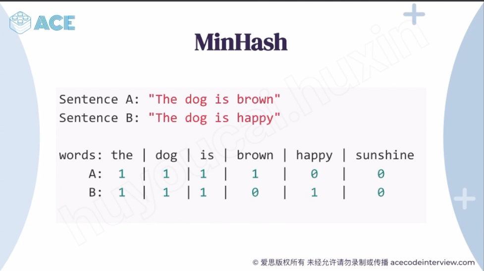

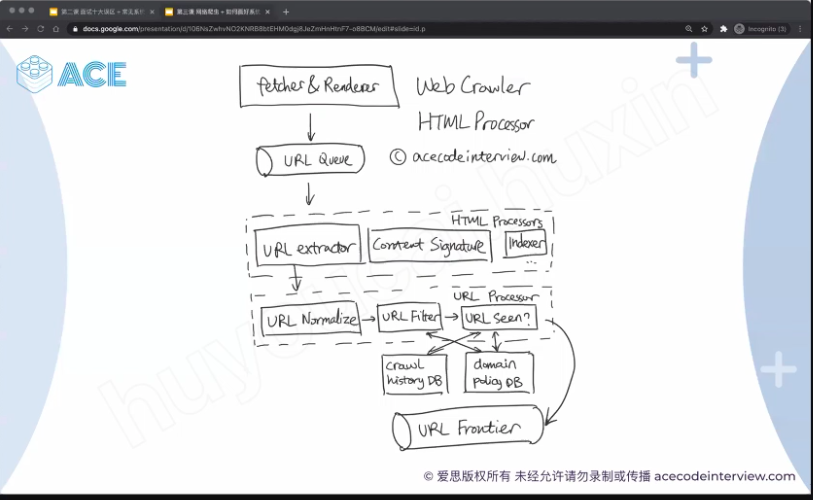

