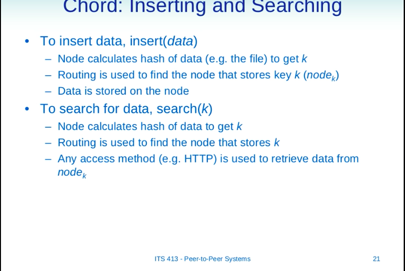
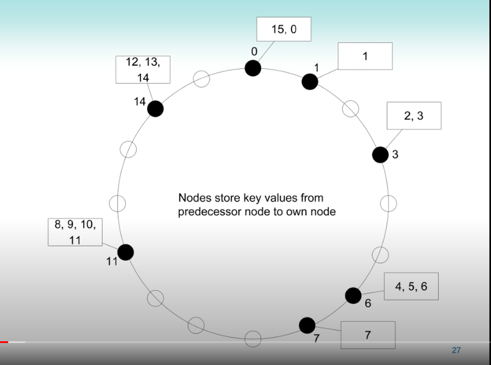
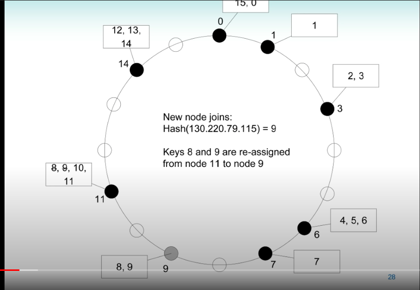
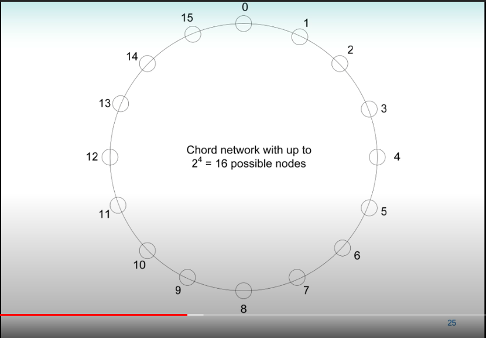

# Chord,  consist hash -new 

Created: 2020-12-21 17:26:28 -0600

Modified: 2021-01-17 17:27:56 -0600

---

[ITS413, Lecture 21, 29 Mar 2012](https://www.youtube.com/watch?v=qqv4OJ5Lc4E&list=PLfTHgzgSsUiRbuCTkkA8O4ADz17jf6aY3&index=1&t=4262s)]]

![Chord: an example DHT N nodes in network --- Aim to distribute files amongst the nodes, and locate the files Consistent hashing is used to assign ID's to nodes and resources --- SHA-I hash of node IP address produces 160-bit ID --- SHA-I hash of file name produces 160-bit key, k Visualise nodes as circle, ordered by ID Resource with key k is stored at node with ID = k --- If node with ID = k does not exist, resource is stored at node with next highest ID Node n joins network: --- Need to reassign keys from successor(n) Node n leaves the network: --- Need to reassign keys to successor(n) ITS 413 • peer-to-peer systems 20 ](../../../media/Web-crawler-^MP2p-Consistent-Hash-Basic-Chord,--consist-hash--new-image1.png){width="5.0in" height="3.7604166666666665in"}

{width="5.0in" height="3.34375in"}

{width="5.0in" height="3.7083333333333335in"}

If node 13 join the network, the resource 12 and 13 will be re-assigned to node 13

Only one node need to be update, only one node need to be modified

{width="5.0in" height="3.4479166666666665in"}

{width="5.0in" height="3.75in"}

We just need to update the successive node

Search

Each note has a routing table, just single entry it store the next node in the ring

Node 0 has a IP address of node 1

{width="5.0in" height="3.71875in"}

It is good for small network, small groups of nodes

Another way is one node has multiple entries in the routing table, up to 4 of another nodes

Node 0 has ip address of 1,2,4 and 8, ( 1 ,2 ,4 and 8 position away)

But some nodes may not exists , we will maintain the next one ( node 2 not exists, next one does exist is 3)

Node 0 will maintain 4 another nodes: 1,3,7,9

![Chord: Routing Example Node 0 routing (or finger) table: • --- Start = 1; Interval = 1 -5 1; Successor = 1 --- Start = 2; Interval = 2 -Y 3; Successor = 3 --- Start = 4; Interval = 4 -Y 7; Successor = 7 --- Start = 8; Interval = 8 -5 15; Successor = 9 (The 3rd line can be read as: "in order to find a node with key 4, 5, 6 or 7, then send to node 7") Node 9 routing (or finger) table: --- Start = 10; Interval = 10 10; Successor = 11 --- Start = 11; Interval = 11-5 12; Successor = 11 --- Start = 13; Interval = 13 0; Successor = 14 --- Start = 1; Interval = 1 -Y 8; Successor = 1 ITS 413 - Peer-to-peer Systems 23 ](../../../media/Web-crawler-^MP2p-Consistent-Hash-Basic-Chord,--consist-hash--new-image7.png){width="5.0in" height="3.6458333333333335in"}

The 3rd line read: in order to find a node from 4 to 7 we need send the request to node 7

Interval = key space, use key space for search

{width="5.0in" height="3.46875in"}

Assume all the node exists

If the node 0 search key 13, node 0 has 4 rotes to nodes 1,2,4,8 : node 0 will send the request to node 8

Simar, node 8 also has 4 routes: 1 position way, 2 position way 4 and 8 position ways

8 will send to 12 and 12 will send to 13

If we has 2^4 nodes, each node has 4 entries of routing table, 1 = 2^0, 2 = 2 2^1 , 4 =2^2 and 8 2^3 position away

If we has 2^10 nodes, we have 10 entries of routing table : 1- 512 position way, half way cross the network

For million of nodes

Each node know on logN other nodes

![Chord: Routing Example Assume a search(k=13) is performed at node O --- Node O knows node 9 has coverage of the keys from 8 to 15 --- Node O sends a search message to node 9 Node 9 does not have the data with key 13 Node 9 knows node 14 has coverage of the keys from 13 to O Node 9 sends a search message to node 14 Node 14 has the data with key 13 --- Node 14 responds directly to node O • Assumes the original search query includes node o's IP address/port Key benefits: --- A node stores information about a small number of other nodes • Routes to m nodes, if there are up to 2m nodes in the network • This is good --- reduces amount of maintenance between nodes --- A node can quickly locate the resource ITS 413 • peer-to-peer systems ](../../../media/Web-crawler-^MP2p-Consistent-Hash-Basic-Chord,--consist-hash--new-image9.png){width="5.0in" height="3.5in"}

{width="5.0in" height="3.71875in"}

