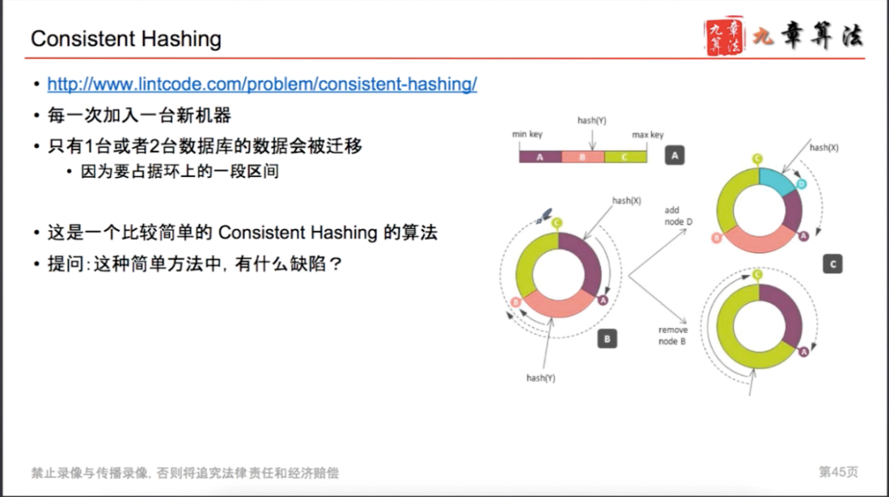
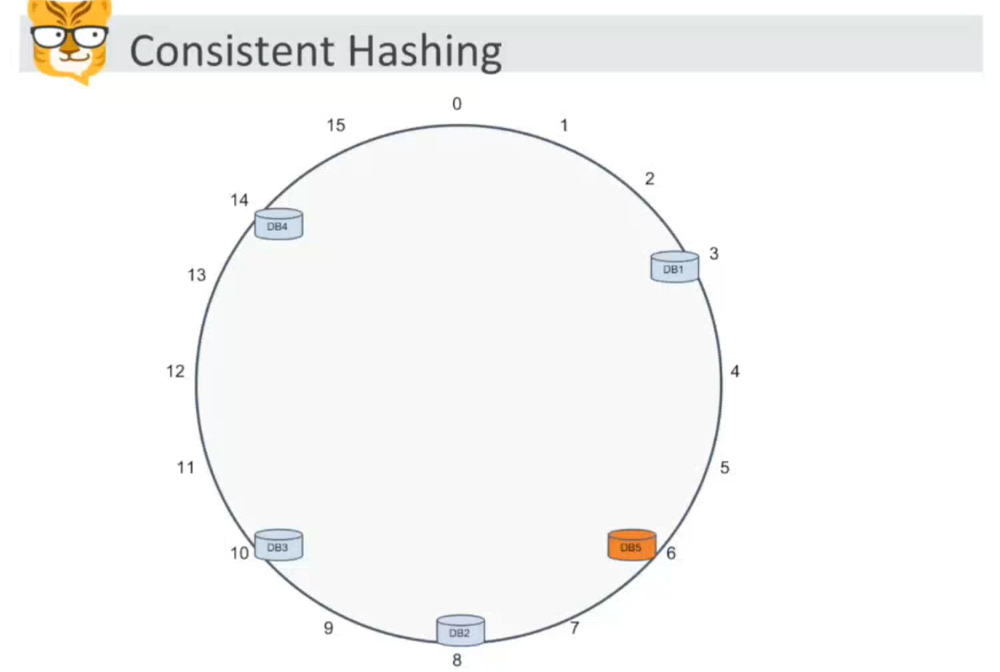
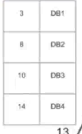

# Consistent Hash

Created: 2017-04-29 17:37:22 -0600

Modified: 2020-12-21 17:26:58 -0600

---

{width="5.0in" height="2.798611111111111in"}

![Consistent Hashing Il Description D Notes Testcase Judge Consistent Hashing I micro-shards 95", I. * A 0-359 O- n-l MIE], k micro-shards, 3. hash function micro-shard n NoSQL 1000. micro-shard fi consistent hashing 1 . create(int n, int k) 2. addMachine(int machine_id) // add a new machine, return a list of shard ids. 3. getMachineldByHashCode(int hashcode) // return machine id ](../../../media/Web-crawler-^MP2p-Consistent-Hash-Basic-Consistent-Hash-image2.png){width="4.458333333333333in" height="6.5in"}

![i Notice 2A64fi, Have you met this question in a real interview? Yes Example create (lee, 3) addMachine(1) [3, 41, gø] getMachineIdByHashCode (4) addMachine(2) [11, 55, 831 getMachineIdByHashCode (61) getMachineIdByHashCode (91) ](../../../media/Web-crawler-^MP2p-Consistent-Hash-Basic-Consistent-Hash-image3.png){width="4.965277777777778in" height="5.4375in"}

![public class Solution { public int n, k; public Set<lnteger» ids null; public Map<lnteger, List<lnteger» machines // @param n a positive integer // @param k a positive integer // @return a Solution object getMachi neldByHashCode = null; public static Solution create(int n, int k) { // Write your code here Solution solution new Solution(); solution.n = n; solution. k solution. ids new solution. machines new HashMap<Integer, return solution; // @param machine_id an integer // @return a list of shard ids public List<lnteger» addMachine(int machine_id) { // Write your code here Random ra -new Random(); List<lnteger> random_nums = new for (int i int index ra.nextlnt(n); while (ids. contains(index)) index ra.nextlnt(n); ids . add(index); random_nums. add(i ndex) ; Coll ect ions. ; machines. random_nums); return random---nums; ](../../../media/Web-crawler-^MP2p-Consistent-Hash-Basic-Consistent-Hash-image4.png){width="5.0in" height="5.076388888888889in"}

{width="5.0in" height="3.0694444444444446in"}

{width="5.0in" height="2.7152777777777777in"}

Consistent Hash

Traditional way just use value % size

Two problems:

if add new machine that mean the hash function is changed . We need re-calculated all the mapping, move almost everything to the new machine.

it is not loaded balance. the data was not distributed equality between the machines

For the **consistent hash**, almost k/n keys need to be remapped.

'k' is the total number of keys and 'n' is the total number of servers

Further

suppose there is a ring and we divided the ring into n part (2^64)

- every add a new machine, sign k( 1000) randomly to the ring. Those k called virtual node ( the number should less then 2^64)

**To map key to the machine:**

Hash it to a single integer ( value % 2 ^64)

Move clockwise on the ring until finding the first virtual node ~~or first machine~~ it encounters. we will that machine to store than value.

**Added a new machine:**

To add a new server, say D, keys that were originally stored his neighbor (next key, clockwise) will shifted to D

For example 1-2-A->3->C->4-B

C is new machine and will ask B for node 3

**Delete a new machine:**

To remove a machine or if a machine failed, say A, all keys or data that were originally mapping to A will fall into B, and only those keys need to be moved to B, other keys will not be affected.

{width="5.0in" height="2.8541666666666665in"}

{width="5.0in" height="2.7916666666666665in"}

Bittger CS503 week2 C22

{width="5.0in" height="3.3541666666666665in"}

c1 is for 3 to 15

c2 is for 8 to 4

c3 is for 10 to 9

c4 is for 14 to 11

{width="1.4305555555555556in" height="2.3194444444444446in"}

if the value after hash is 12, we need find the first value bigger than 12, is db 4, so this value is stored in db4 ( clockwise around to find the first db he meet)

