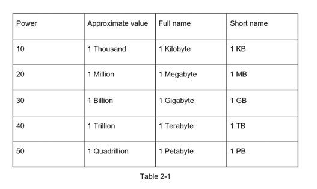

# since 62 ^ 5 = 900M, 62 ^ 6 = 57 Bill , 62 ^ 7 = 3.5 T

Created: 2021-01-27 10:51:24 -0600

Modified: 2021-01-27 10:53:19 -0600

---

{width="5.0in" height="2.96875in"}

[since 62 ^ 5 = 900M, 62 ^ 6 = 57 Bill , 62 ^ 7 = 3.5 T]{.mark}

[so we can use most 7 digital base 62 string to present the long url]{.mark}

[Since 3.5T ~ 2^ 42, so we can use 42 bits id]{.mark}

