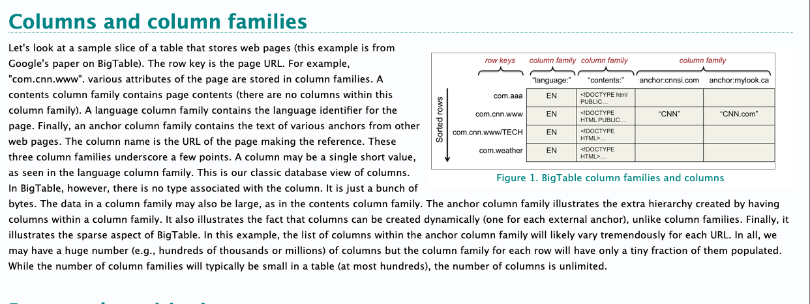
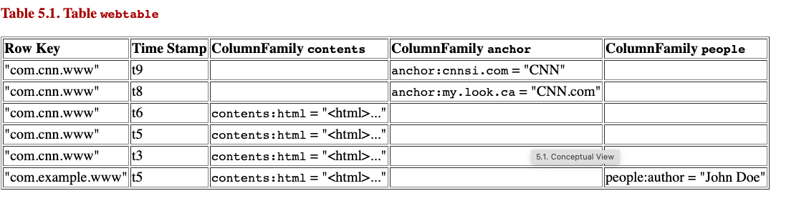

# System Design distributed web crawler to crawl Billions of web pages | web crawler system design

Created: 2021-01-07 16:01:06 -0600

Modified: 2021-03-12 22:06:18 -0600

---

[System Design distributed web crawler to crawl Billions of web pages | web crawler system design](https://www.youtube.com/watch?v=BKZxZwUgL3Y&t=519s)

the [seed URLs]{.mark} what the seed URLs means is the initiator URLs for any

crawlers to crawl it needs to go to some site to keep on fetching the urls in

that page and then keep crawling and keep crawling right so we need to provide some of the seed URL to start with

~~so the ideal strategy is to is from all the different sectors like education~~

~~entertainment travel blog and finance so collect all the top 100 sites and then~~

~~ready to make a list of it and then have it as a seed URL, and then push it into URL frontier so URL frontier is the data structure which actually is built using queues which actually gives the priority and politeness features built in, so I'm~~

~~Fetcher and render, this is where all the data is fetched~~

~~so what are these are basically implemented using either threads or processes or anything basically which gives concurrency I mean most likely thread is the one right but if you're~~

~~using Python you can actually use a sync i/o which gives even better performance when it is making I go operations so for now let's take it as thread~~

~~we can scale these features and renderer basically both component into one so both of the components are built into you know one worker itself so call it as workers for now ,which actually has fetcher and then renderer, we can scale this like as many numbers we want by adding more and more machines each machines will have more threats~~,

So we can scale it to any number of you know threats we want to it all depends

on how much parallelization we have to do so, it includes two components one is fetching and one is rendering fetching

as the name itself suggests it basically gets the content of the URL basically it does the curl or request out guide outpost based on the HTTP method ,so how does it start so

these workers actually are threads right so whenever a thread is free it is going

to ask you RL frontier to provide a URL to crawler, it's that simple okay so when the thread asks URL frontier it provides a URL

so before fetching the actual content of the URL it has to do some stuff what are those is basically talk to the [DNS resolution]{.mark}

why do we have a DNS resolver because if you just do the curl we basically get the content right the resolution and all happens automatically, but why do we need the DNS resolver there are a couple of reasons

why because if we don't have our own custom resolvers, it usually takes a lot of time to resolve because you know the ideal way is like first we will check in operating system and then we will check it in the browser cache, and then we will check it in the ISP and then it goes on different hops right it takes a lot of time to cut down the time spent on DNS resolution, we can implement our own DNS resolver

so we need our own custom DNS resolver where we can just ask the DNS resolver to map provide the IP address of the host name so it basically gives us one more thing is most likely the native library which comes along with the operating system for the resolution is mostly synchronous that causes some problems even though we have multi-threaded environment in machine that module the DNS model basically is is like a synchronous way

or single threaded so all the threads are blocked because of that thread so

basically think it this way to make it more efficient DNS resolution we need a custom DNS resolver so the fetcher basically gets the IP address of the host name we are going to fetch and then using the IP address in the path it is going to fetch the page from the internet so once we have the content

[Render:]{.mark}

what we have to do the content we can't just directly use it like earlier days

we never had angular or react JS like JS frameworks right, so it used to be page which has the content already in it once once we do you know processing of that page like removing the tags and, everything we used to get the content itself but now it's not the same way we

do it because we use front-end Amissah

pattern like single page applications

where lot of content will be downloaded as synchronously or by Ajax so that's

the reason why we can't just fetch the content and process on top of it,

we'll have to render it also we had to do server-side rendering

basically renders using the JavaScript, basically they execute the JavaScript on the server side and it does all the Ajax call and loads the page so we have the complete page available there are optimization these days people are doing the index page, they do server-side

rendering from their side itself so we

don't need to do from here but anyway we had to do the render rendering and then

check if the page is complete

then most likely our work is finished and one more thing the fetcher should do is set the user agent to appropriate, you know crawling company name or something like

Google sets it to Google - something as

a user agent and similarly and X and

other Bing doctor go sets it to its own

user agent the advantage is so that the

website admins can

configure these servers to behave a

little bit differently for the search

engine itself so that's one thing and

the next thing is once they once the executors fetch the content and render

it the final thing is they need to cache it or the save it into the persistent storage in here, and also cache it in the Redis

for two reasons, persistent storage we might compress and store it so it will be a little difficult for other processes to fetch it and compress it's like time consuming so that's the reason why we need to cache it as well for some duration ,so that the the processors will

take that webpage and do some analysis on top of it

so yeah that's one thing so

once the executor fetches a response, the next thing they need to do is add a message here pointing to the message queue an told response which we have saved in the Redis so as of now in this design

We have two processors here we can have more number of processors here's like

one is [URL extractor]{.mark} that is kind of default processor we need two because we

need to keep on crawling from one page to another page with all of the links

which we find there like other processing is [duplicate detection]{.mark} one more thing which we can do is like no malware detection etc etc so this is

what we get the extensibility feature where you can add more processors, every processors which we add receives that message copy of message for everyone and then they do their own processing, since Redis is faster fetching the content from here is also faster, because it's in memory so we get the page we process it and save the result wherever you want it

could be data base or it could be whatever so

so the next thing we need to know is [URL extractor]{.mark} what it does is as the name indicates it's work is to extract the URL from the page which we

just got or crawled it, so what does it mean basically we will find a lot of URLs like this picture, this web page has a lot of links in this page itself, so it could be pointing to the same website or it could be pointing to the different website, or it could be pointing to the same web sites different sub domain, all of this we need to do some processing over here while extracting the URL ,so maybe sometimes some URLs might be pointing to the same page with

a pummeling than that case we don't need that link to be re-crawled it again

because it's essentially pointing to the same page, itself sometimes yeah what

other [URL normalization]{.mark} we need to do the first thing is we need to point all

of the subdomains of the same website,to this we need to map it to the same

Domain say for example blog.google.com, mail.google.com maybe you know keep google.com all of these subdomains are actually essentially part of Google itself ,so we need to tag all of this, sub-game subdomains into same website called google.com so that's one thing

and the next thing is we need to append or append the backslash to the end of

the URL to make it a standard URL format and the next thing is we might need to append HTTP protocol if it is missing

and then one more thing is a lowercase or uppercase say ,some sites will

have the URLs upper-caste so we only have to make it a standard convention of

converting it to a lowercase, so these kind of normal you are you are a

normalization we need to do and then we get a set of unique URLs we got it from that page which we just scroll all of that URL should be passed

next to the URL filter, so what does URL filter do so URL filter actually is dependent on the characteristic of the crawler which you

are trying to build so if you are trying to build a crawler which crawls only the

mp3s then that means the URL filters, only filters the mp3 URL so the links to

mp3 is only, if you are trying to build a crawler which only fetches the HTML

pages that means that this filter should filter all of the URLs by mime type so

it could be by applying the rejects by checking the you know extension, in the

end of the URL maybe if any URL contains dot mp3 dot mp4 dot any format right so, dot jpg so we are not really interested in those kind of URLs we don't need to crawl

further to those pages and then do some processing because essentially they're pointing to some kind of media so we had to remove all of those URLs and keep the, URLs which we think they are HTML so that's what the URL filter does by checking the mime type and the URL rejects pattern so once we do the URL filtering so we have the unique URLs in our hand so those are essentially kind of like a HTML pages only now what we had to do so

the next thing is also crucial things so we need to check whether that URLs are already crawled or do we have those URLs in our system so how do we check it maybe we have a list of URL for a given term, I say google.com we have a list of all the URLs which we crawled say block toward google.com / a lot of blogs list of URL so it could be like enormous right it could be like, so many URLs like how do you check whether this URL is already in the list or crawled or as such so search is always a difficult thing so it could take order of n

so that's bad so for that definitely you will be using bloom filter so you need to use bloom filter here so using the [bloom filter]{.mark} it's a problem with citrine structure so ,it means that it's not always right when it says NO, this URL is not present ,it's always 100% sure, when it says YES that might be the case it is like the some probability it might be wrong ,but it's fine that even if you miss some URLs, because the next time we might encounter the same URL, we never know so basically

we use the bloom filter to make it more efficient to check, whether that URL is

crawled if that URL is already crawled then we don't need to include that for

the further processing drop it, otherwise keep carrying the list of URLs we got it

so what you are in loader does is it is always also a good idea to save all of

the URLs which we crawled for a given domain, so you can either save it into a

database like no sequel, or you can append all of the URLs which you crawled

for a domain in a file and put it into HDFS like this will be a file system to

save them, so basically it's just a mapping of domain to all of the URLs

which you have crawled that's one thing so we can save it, if you want it all

depends again on the use cases let's think okay we are saving it we are

saving it to into a file say the file, name is google.com and then all of the

orders which we crawled is inside this file maybe this is like so

techcrunch.com and all of the URLs from

the TechCrunch which we crawled is kind

of appended and saved into our

distributed file system so we have all

the list of URLs from any given domain

and now also we need to forward those URLs which the unique URLs which we got from the crowd next to the [URL frontier]{.mark}

so if you look at the system diagram the URL frontier is the one who actually

gives out the URL to the threads to in a crawl, so that means that the URL

fronteira is kind of responsible to handle the priority of the URL ,and also

to handle the politeness that means that the priority which also gives the

meaning of how to when to recrawl and, also the freshness of the page ,so if it

is a new site that means that we have to keep on crawling every now, and then like every five minute, ones or maybe every 10 minute ones or every one are ones that means that for the new sites or the web sites, which serves the news content the priority is really high

and also we need to implement the politeness that means that we shouldn't be overwhelming the server ,or we had to always ensure that only one connection is always established from the crawler to the server of given host and also there should be a delay between each and everycalls to that particular host

so there are two sub modules to it the first one is front queue and the

bacuse and all of this is what the URL frontier is we have the prioritize er

here and then we have the back queue router , we have heaps and we have back queue selector and we have the table to map all of them and then we have the threads these are the fetches and renders the threads which basically ask the URL the you selector will give the URL to fetch

For the front queue, there are like F number of queue, which is up to us what is F is the maximum number of front queue which is equivalent to the maximum priority we have it was n, maybe like okay I decide

that I want priorities from 1 to 1000, so I'll be having thousand cues thousand front queue, so this will be thousand that means this is the first cue second cue and this is the thousandth the cue okay, now

what this contains this contains the ,URLs that's it like nothing much fancy about it it contains the URLs it could be mixed of URLs, say there could be one

the higher priority the URL it goes to the higher number, and it's all up to

prioritize to decide what priority

we should give to that URL how do we decide which URL gets what priority it

all depends on the historical information, which we have when we were

crawling so we have to analyze the historical information like how

frequently the page of a site was

changing say for example one site was

changing the content everyone our once

that means that it most likely that it

is like a high priority site we have to

keep crawling there could be some sites

which are like hosts a lot of static

content that means that when I crawl

today and when I crawl tomorrow also the

content on the URL is not changing that

means that these sites can be of low

Priority

we can crawl it really slow with with a

lot of with more delay or crawl once in

a week or something like that but the

new sites definitely we should crawl

once in our or something like so the

higher priority goes to those kind of

URLs it all depends on the how

frequently the content changes on the on

any given host on a website or a URL

So so now we can map a URL to the priority ,now if the prioritized with the

information it has the historical information it can prioritize and then push it to whatever priority keys it it

wants to so now we have URLs here now what happens now we have the back

Router, here the back router job is to ensure none of the back queueare empty

so whenever back queue, this is so fast in first out okay, and there will be like

one to be number of back queue which is equivalent to the number of threads

which are there in the fetcher, okay the total number of threads should be equal to the number of back use which we have in the URL frontier, so now this back router always makes make sure that none of the back cues are empty

how does it know it keeps on monitoring the queues and its size, whenever a URL whenever a queue is empty ,basically if it pulls from the higher priority queues and then pushes it here, there are chances that these queues

might be empty, because we pulled a lot of URLs from the higher priority one

these are a lot to be empty ,but not these ones so the back router will pull

the higher priority urls and put it into these queues

here one important thing is a queue will be designated to one and only one host or one and only one website, that means that we can't have the queue named after website, instead we have the to number and in the table we'll have to map those you know queue number to the host name

this keeps on changes as in, keeps on this hostname to the mapping of the back ,you will keep on changes, as and when we see a different kind of set of URLs maybe within an R we finished all the crawling of digit comm that means

that this will go away, if there is something new host is coming maybe like

HBO comm in that case this will be replaced with HG hp.com and as I need to

the queue id 5 that means that all the URLs belongs to the HP.comm will be in the 5 queue, there will be always URLs which belongs to the same website

okay that's one more criteria why do we need to do that the important thing you need to remember is politeness, [means we don't want to make tons of calls to the same website to fetch the information]{.mark} right because we need to make call one by one ,

that means that for HP .comm if I fetch one page from page now at time t1 that that means that the next call should happen after t1, with some delay only we can't have parallel calls to hp.com, that's why we need to put it in

the queue so we get the ordering of the same of the URLs of the same

hostname

we mix all of them to implement politeness and priority

let's take an example from that side so now the fetcher is free, that means that

a thread is free to crawl of website what it does is it asks the back queue

selector give me a URL, I just want a URL, give me one ,I'll crawl it ,the back queue selector, what it does is it goes to [heap]{.mark} and then checks what is the URL or which I should pull a URL, and then give it to the fetcher

how does it know there will be one to be entries in the heap that is

equal in to the number of back queue right that's the reason, why we have heap

In the heap, we will store the next time of back queue select will fetches a URL from heap and sent to the fetcher

I entry which has the minimum time in it say the minimum time represents when to fetch it or how early to fetch it, so say

it just fetches it just pulls one URL and gives it to the fetcher and that thread has to update the heap back so once it finishes it ,it also tells that

heap I have finished this, means initially, we fetched one right it it

updates the time of this one to maybe seven

we have we have given about 6 minutes of delay of between one call to one more curve that means we are kind of implementing the politeness

heapify it we get the minimum number at the tops in that node we keep

on plucking it so the next when we do it

we get this one meanwhile if the thread

to finish the city it updates this value

to something else maybe ten something

like that so this is used to know which

queue is the queue we need from which I

need to plug the URL based on the

minimum time the upcoming time at which

we have to fetch it sometimes it might

happen that there are no URLs to be

fetched right now in that case most

likely the threads will be halted so the

key is how much delay we give between

the calls I mean it's okay to not to

give delay or as well because we made a

call to hp.com we can immediately make a

call once that call finishes the first

call finishes the second call can be

started so we don't need to give a delay

it's just that we need to track the

times to make sure that there are no two

parallel calls going into the same

hostname

maybe we completely fetch all the URLs

in the TechCrunch comm that means that

back yato we'll know that okay

technically short comment we finished it

so it gets the next priority queue which

is which has a lot of URLs it fills in

and then updates the table and and

everything keeps on working the way it

was supposed to be the only key criteria

of this is

[as I mentioned it should be always non-empty and one cube per thread]{.mark}

[and one cube per host only]{.mark} at

next important thing we need to understand is how to detect updates and

how to detect duplicates so why do we

need to detect updates because we have to we should know how frequently the data in a page is getting changed or data in a website is getting changed

that way we can adjust a crawl rate or how frequently to crawl that site so for

that we need to keep on checking how frequently the updates to the page is

happening so how do we do that do we need to completely fetch the page or is

there any other strategy one strategy such is instead of downloading the

entire content [we can make a head reques]{.mark}t in the head request will basically get the last modified time if the last modified time which we got by the head request and the previous crawled are same that means that the

page has not modified so we don't need to actually download the whole content

directing the duplicates

Hashing is like you get a unique hash for a page it's like a signature right so you had two pages so how do we make sure that these two are duplicate or not,

when you compute the md5 or sha-1 or whatever so in that case we get some

hash something like you do something

like that

so next do the same thing basically whenever you're processing as a

processor you can add this as well like like hash calculator or something but things might happen this way

not always every word in the page you say this signature logic only works if

the page is very identical to the every character, but when people copy they

don't copy entire site sometimes they only copy the content and then place it

in their side practice will be totally different

because of HTML tags are some other content which is there in the page so so

this is also not promising so signature calculation is also not promising so

there are other set of algorithms which gives you the probability lipstick

matching are near what do you call that

we call it as [a near duplicate search]{.mark} ,it's like even though some words are

missing or some percentage of words are different we still category it as a duplicate content that we can set a threshold as

near match documents so one such

algorithm which Google uses is sim hash

How to store

<https://www.cs.rutgers.edu/~pxk/417/notes/content/bigtable.html>

{width="5.0in" height="1.875in"}

{width="5.0in" height="1.3333333333333333in"}

