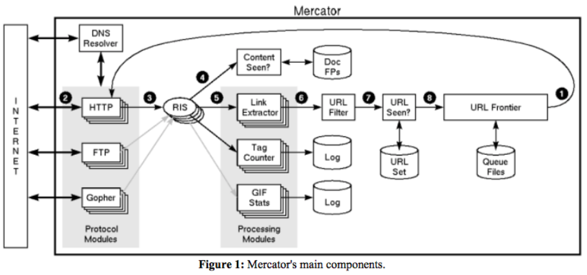

# Web crawler --- 

Created: 2017-09-16 14:36:27 -0600

Modified: 2021-01-07 13:08:52 -0600

---

{width="5.0in" height="2.3402777777777777in"}

1.  The first step of this loop is to remove an absolute URL from the shared URL frontier for downloading.
2.  Based on the URL's scheme（ http, ftp...), the worker selects the appropriate protocol module for downloading the document,which downloads the document from the Internet
3.  downloads the document from the Internet into a per-thread RewindInputStream (or RIS for short).
4.  Once the document has been written to the RIS, the worker thread invokes the content-seen test to determine whether this document (associated with a different URL) has been seen before . If so, the document is not processed any further
5.  Every downloaded document has an associated MIME type. In addition to associating schemes with protocol modules, a Mercator configuration file also associates MIME types with one or more processing modules. A processing module is an abstraction for processing downloaded documents, for instance extracting links from HTML pages, counting the tags found in HTML pages, or collecting statistics about GIF images. Like protocol modules, there is a separate instance of each processing module per thread. In general, processing modules may have side-effects on the state of the crawler, as well as on their own internal state.

