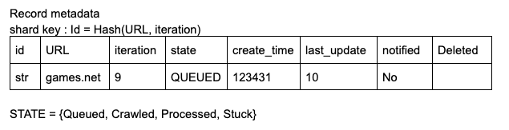

# summary 3 -- update 2020/Dec

Created: 2018-02-04 10:53:31 -0600

Modified: 2021-02-15 00:56:34 -0600

---

requirement

Do we need to repeatcrawl partical website

[Is it possible assume how many web page need to be crawl?]{.mark}

we want to crawl 15 billion pages within four weeks

[How long we need crawl those pages]{.mark}

[Is it a crawler forHTML pages only?]{.mark} Or should we fetch and store other types of media, such as sound files, images, videos,etc?

[]{.mark}How do we handle web pages with duplicate content?

[Non feature requirement]{.mark}

1.  Scalability or flexibility in scale: we can add or remove the crawler base on the task

~~Availability~~

2.  Fault tolerant : idempotent, we may need to restart some action if Some service crash, the repeating action should be idempoten~~t~~

Politeness :

[The crawler should not make too many requests to a website within a short time interval.]{.mark}

From the whole system perspective, server end throttling is the main limitation

- Use different accounts
- Use different IPs
- Multi-thread
- Be a good citizen, don't bring down the server
- The same node crawl several sites in parallel

Schema flexible / extensible

[Capacity Estimation and Constraints]{.mark}

If we want to crawl 15 billion pages within four weeks, how many pages do we need to fetch per second?

15B / (4 weeks * 7 days * 86400 sec) ~= 6200 pages/sec

What about storage?

We assume page has 100k and 500 bytes of metadata

15B * (100KB + 500) ~= 1.5 petabytes

Assuming a 70% capacity model (we don't want to go above 70% of the total capacity of our storage system), total storage we will need:

1.petabytes / 0.7 ~= 2.14 petabytes

[Strategy]{.mark}

The basic algorithm executed by any Web crawler is to take a list of whitelisted domains and [seed URLs]{.mark} as its input and repeatedly execute the following steps.

- Pick a URL from the unvisited URL list.
- [Async]{.mark} crawl the URL
- Parse the document contents and store the data, index the contents.
- look for new URLs in the whitelisted, Add the new URLs to the list of unvisited URLs.

[High Architecture]{.mark}

{width="5.0in" height="4.28125in"}

API

AddScheduledCrawl(domain_names, cron_expression=null);

StartCrawling(domain_names, iteration, blacklisted_URLs, **type {on_demand, schedule})**;

1.  the scheduler will trigger the crawler task start

Scheduler(Apache Airflow):

1.  Read YAML: what to crawl
2.  Insert seed in records metadata, no-operation if exists
    1.  [Send and forget to crawler]{.mark}
3.  Insert progress in progress table, no-op if exists

(scheduler service will insert a new record on the URL table and crawler worker will insert a new record in the [iteration]{.mark} table

4.  If fault, go back to state 1.

[Heavy load processing usually stateless, send & forget]{.mark}

{width="5.0in" height="1.2395833333333333in"}

cron express is task start time or frequency

{width="5.0in" height="1.0520833333333333in"}

URL table

{width="5.0in" height="1.28125in"}

[Url state: queue, crawled, processed stuck]{.mark}

Crawler: stateless

- Read the URL need to be crawled, if already crawled, no-op [how to find duplicate? since the primary key is url +iterator so maybe there is no duplicate for url+iterator]{.mark}

- Crawl the URL, store data into raw data table
- Update record to crawled
- Update the Iteration table

2.crawls in one service or different services should get the URL from metadata database, update the url table~~,~~ it is stateless ( send and forget)

3.after crawls get the task, it will determine the IP Address of its host-name.

DNS Resolver is a bottleneck for crawlers because DNS requests might take time due to the synchronous nature of many DNS interfaces. DNS response time ranges from 10ms to 200ms. Once a request to DNS is carried out by a crawler thread, other threads are blocked until the first request is completed. Maintaining our DNS cache to avoid calling DNS frequently is an effective technique for speed optimization. Our DNS cache keeps the domain name to IP address mapping and is updated periodically by cron jobs.

4.Establishing a connection to the host and download the corresponding document.

5. Insert the raw data to the raw data table

{width="5.0in" height="1.2604166666666667in"}

If need to crawl image, need another table for image

[For distribution crawler, we need to hash the content and sent to the practical node to see if this raw page has been seen before if not]{.mark}

So raw data base hash(content) ->data. If we see this raw data before, just reject it directly

Parser: stateless (p):)

- Read the record need from raw database to parsed, ~~if already processed~~ / stuck , no-op
- [Parse and validate record]{.mark}:
  - If invalidate, update record to STUCK and return
- Store the validated record to [clean data]{.mark}
- Update record state to PROCESSED

6.Notify the Parse service to parse the document and get the new URLs.

7.Add the new URLs to scheduler table ( the mete data database )or [send the URL to other node]{.mark}

8. Parse service will process the raw data, insert the data to clean data base and update the meta database, --- > update the status from processed to done

[Type]{.mark}

{width="5.0in" height="2.3645833333333335in"}

Fault Tolerant

Sweeper: periodically wake up

- Read records in STUCK state and not yet notified
  - Notify developers to take actions.
  - Mark the record notified
- Read the records in Queued for a long period of time
  - Re-queue a crawl command
- Read the records in Crawled for a long period of time
  - Re-queue a parse command
- Update the iteration progress records:
  - [Send summary notification to users.]{.mark}
  - May need to consolidate if cross shards.

