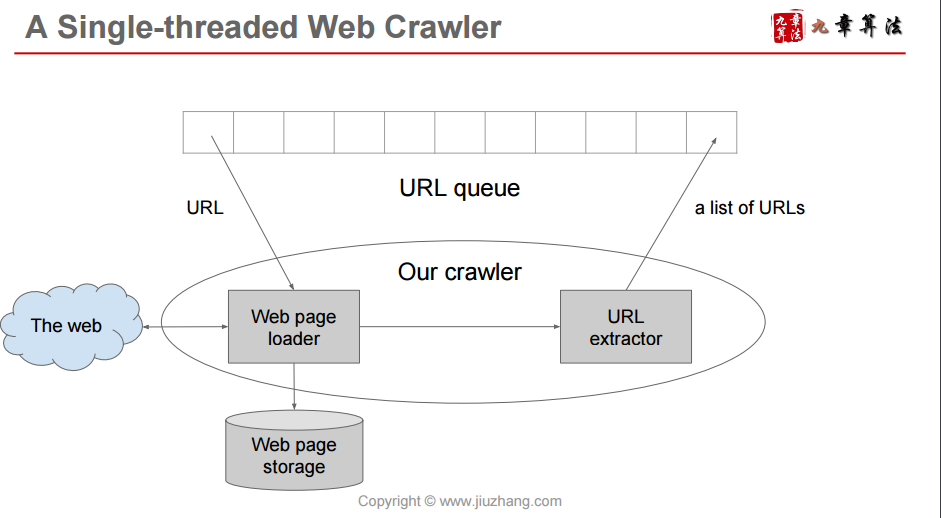
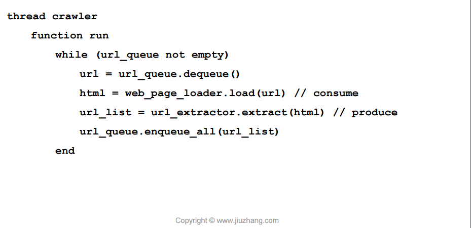
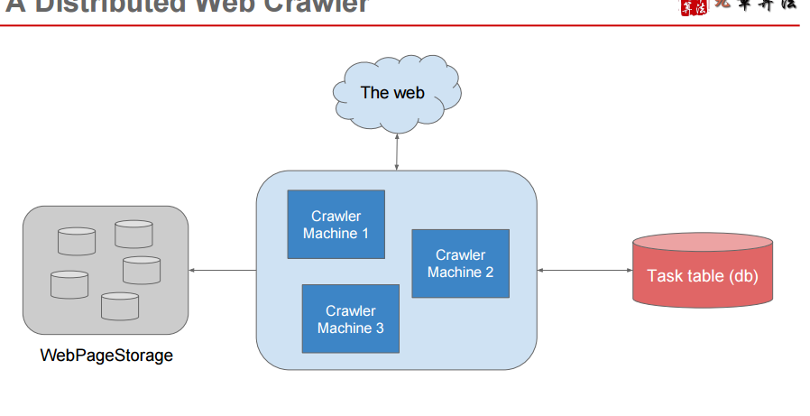
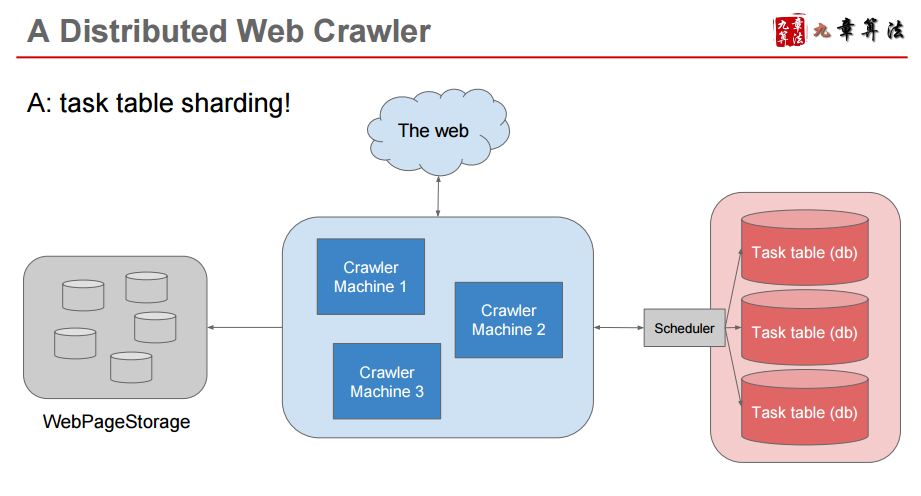
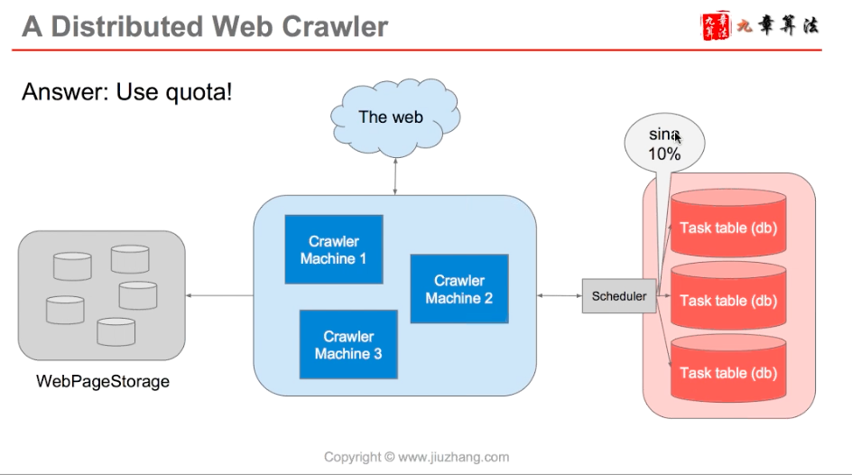

# web crawler, order system

Created: 2017-05-01 11:26:27 -0600

Modified: 2017-06-25 22:08:41 -0600

---

{width="5.0in" height="2.5972222222222223in"}

{width="5.0in" height="2.7777777777777777in"}

{width="5.0in" height="2.75in"}

{width="5.0in" height="2.423611111111111in"}

{width="5.0in" height="2.5625in"}

{width="5.0in" height="2.75in"}

{width="5.0in" height="2.6875in"}

{width="5.0in" height="2.375in"}

{width="5.0in" height="2.7777777777777777in"}

store everything to web page storage

